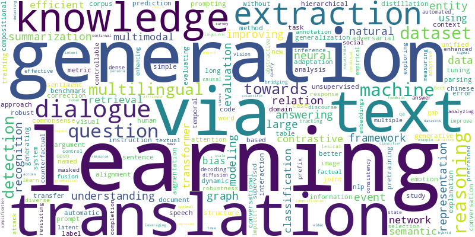
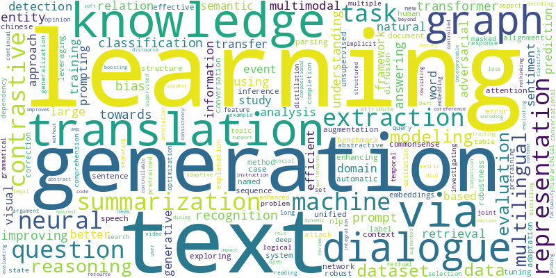
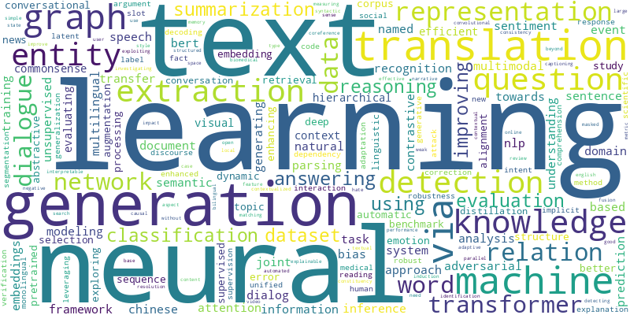
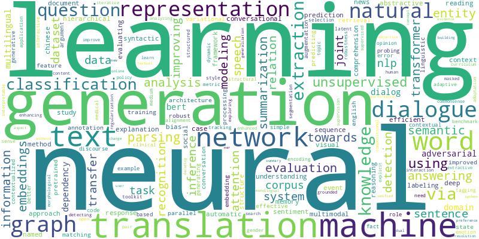
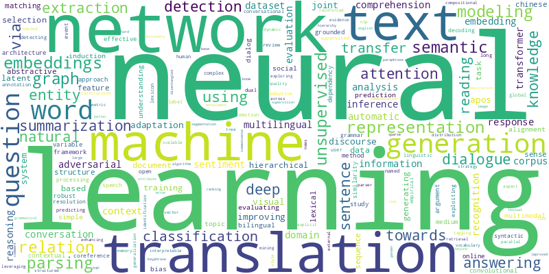
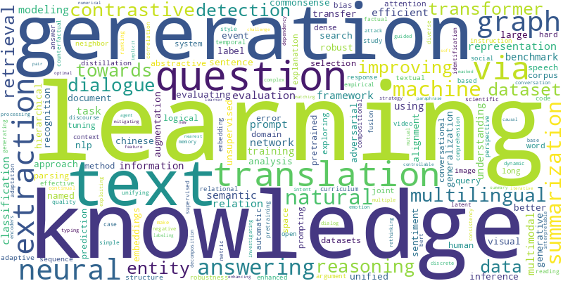
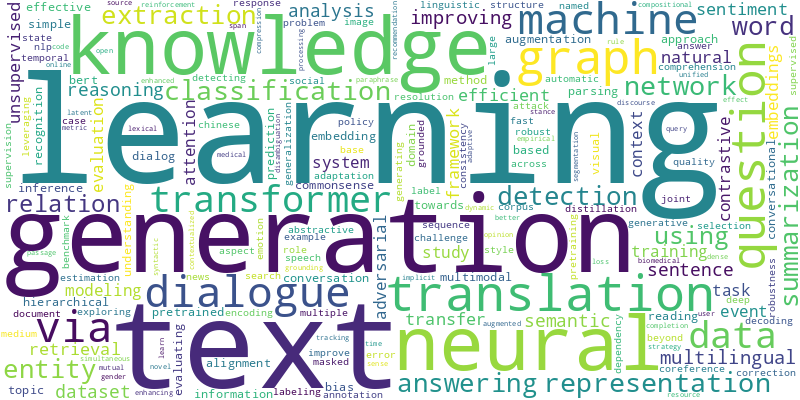
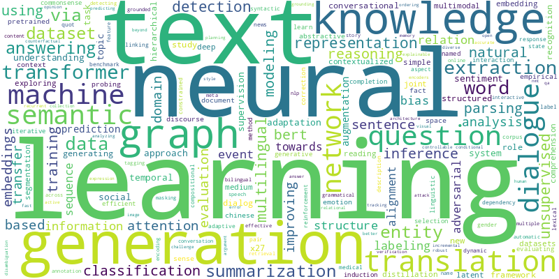
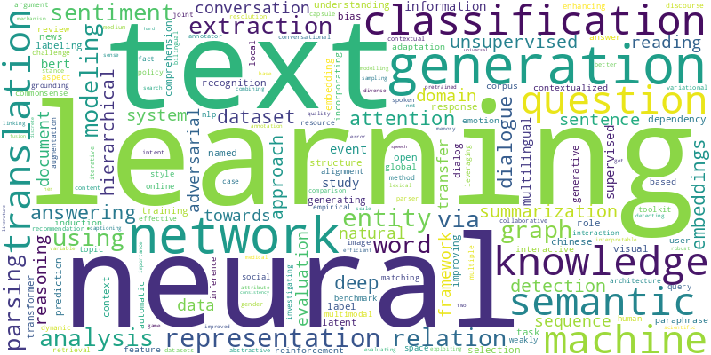

<!-- README Chinese -->

# Conference Title Cloud
一个基于特定年份的NLP会议的标题来可视化词云的小工具。


## 为什么使用 Wordcloud
作为磕盐小白，怎么在浩如烟海的会议论文的中获得可行的研究方向是一个挑战。由于被接受的NLP论文的爆炸式增长，我们每年需要阅读的文章数量是一个天文数字，尤其是像我一样没有明确的研究方向，而且什么论文都喜欢看一点时。受杨晨[[1](https://zhuanlan.zhihu.com/p/577523149)]的启发，基于标题的词云提供了对该领域当前的直观理解。~~这就是为什么这个项目可能会有帮助~~。这个项目起码可以**帮你水一次组会**。

Supported conferences:
- ACL
- EMNLP
- to be updated if necessary
## How to Run
1. Prepared for the packages.
    
    `pip install -r requirements.txt`
2. Run the project

    ```bash
    python main.py 
    options:
        --conference CONFERENCE, -c CONFERENCE
        -y YEAR, --year YEAR
        --track {finding,main,null}
        --all

    #Iterate over
    python main.py --all

    or

    python main.py -c ACL -y 2020
    ```
## Results
### ACL
<table>
  <tr>
    <td align="center">
      
      <br>ACL 2023 Main
    </td>
    <td align="center">
      
      <br>ACL 2023 Finding
    </td>
    <!-- 添加其他图像 -->
  </tr>
  <tr>
    <td align="center">
      
      <br>ACL 2021
    </td>
    <td align="center">
      
      <br>ACL 2020
    </td>
    <!-- 添加其他图像 -->
  </tr>
  <tr>
    <td align="center">
      
      <br>ACL 2019
    </td>
  </tr>
</table>

### EMNLP
<table>
  <tr>
    <td align="center">
      
      <br>EMNLP 2022
    </td>
    <td align="center">
      
      <br>EMNLP 2021
    </td>
    <!-- 添加其他图像 -->
  </tr>
  <tr>
    <td align="center">
      
      <br>EMNLP 2020
    </td>
    <td align="center">
      
      <br>EMNLP 2019
    </td>
    <!-- 添加其他图像 -->
  </tr>
  <tr>
    <td align="center">
      
      <br>ACL 2019
    </td>
  </tr>
</table>

这里有一些简短的观察:

1. 多年来，“Generation”和“Learning”一直是最突出的两个词。

2. 早年“attention”和“representation”引起高度关注。(btw，“xxx就是你所需要的”这句话现在仍然很流行。)

3. QA、对话和翻译是近年来的热门话题。

# Future work
基于LLM的论文主题分类与分析。

如果你对以上Future work感兴趣，请立即联系我，说不定就是一篇未来的顶会文章[手动狗头]。